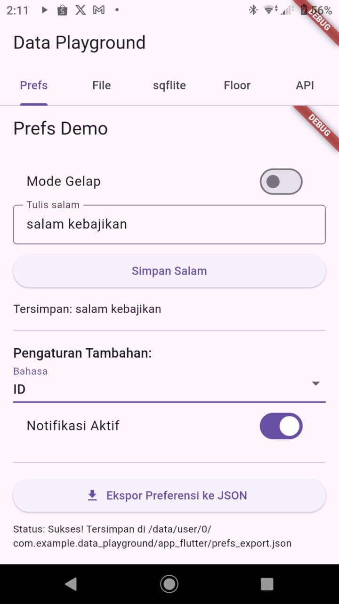
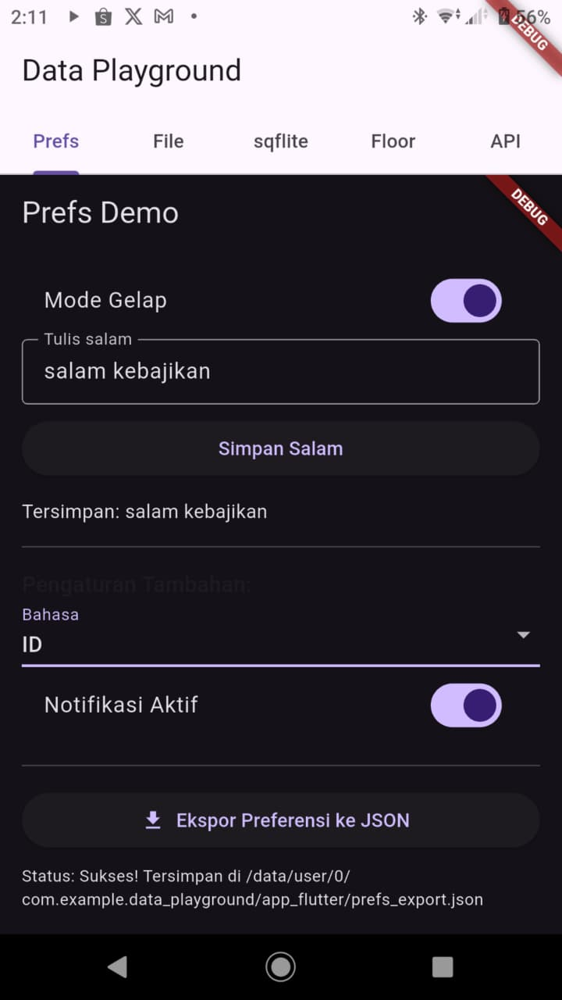
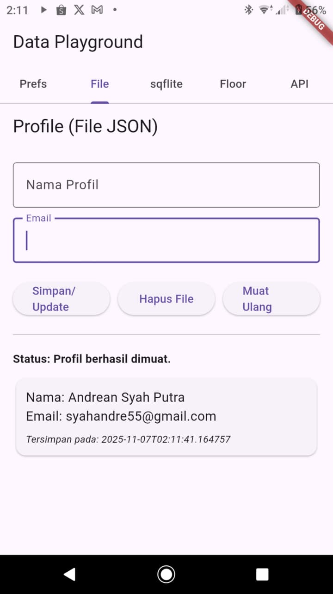
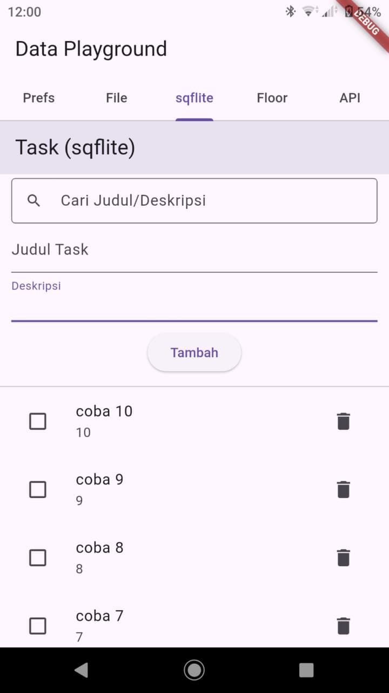
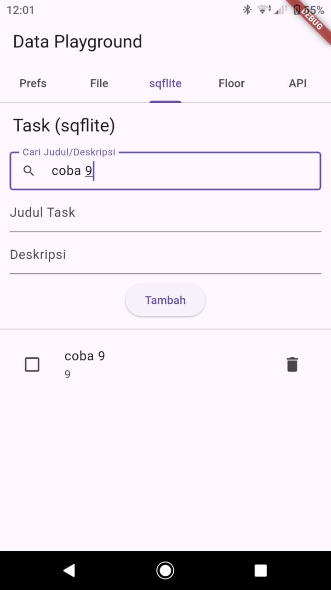
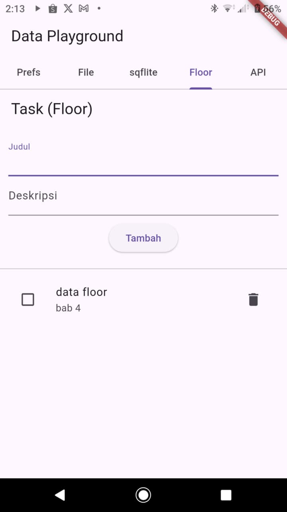
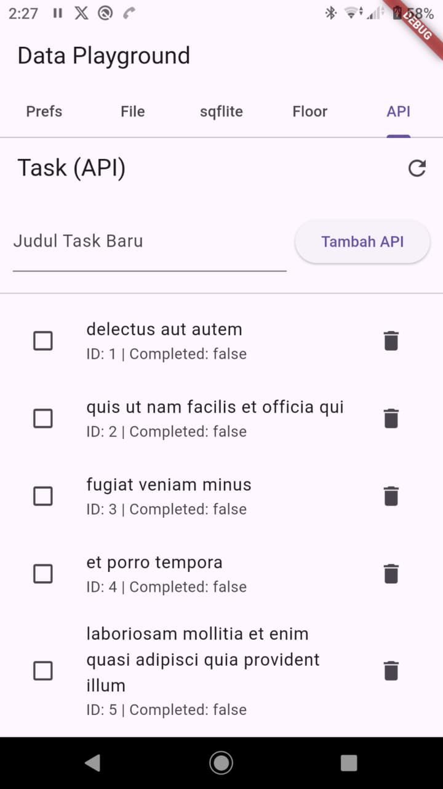
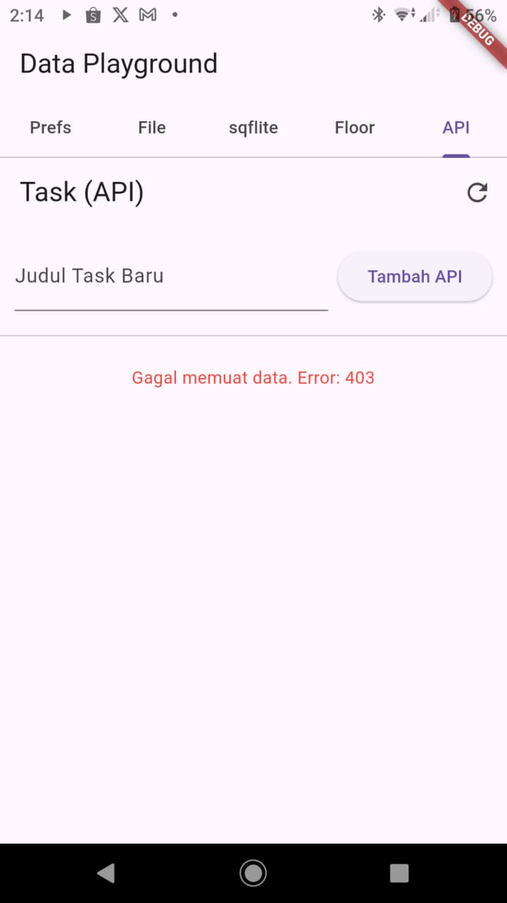

# 🧩 Data Playground  
**Nama:** Andrean Syah Putra  
**NIM:** STI202303719  
**Proyek:** data_playground  
**Modul W9–10 – Flutter: Data Storage (Shared Preferences, File, SQLite, ORM, REST API)**  

---

## 1. ⚙️ Halaman Shared Preferences
Menampilkan form input sederhana, pengaturan **Dark Mode**, dan tombol **ekspor preferensi** ke file JSON.  

   
  <em>Gambar  Tampilan Halaman Shared Preferences</em>

---

   
  <em>Gambar  Tampilan Halaman Dark Mode</em>

---

## 2. 📁 Halaman File Storage (profile.json)
Menampilkan form data profil dan hasil baca dari file `profile.json` di folder dokumen.  

   
  <em>Gambar  Tampilan Halaman profile</em>

---

## 3. 🗃️ Halaman SQLite (sqflite)
Menampilkan daftar data dengan fitur **pencarian** dan **paging** (memuat data bertahap).  

   
  <em>Gambar  Tampilan Halaman SQFLite</em>

---

   
  <em>Gambar  Tampilan Halaman Cari SQLite</em>

---

## 4. 🧱 Halaman ORM (Floor)
Menerapkan **CRUD menggunakan ORM Floor** dengan data yang **reaktif** (otomatis memperbarui tampilan).  

   
  <em>Gambar  Tampilan Halaman ORM (Floor)</em>

---

## 5. 🌐 Halaman REST API
Menerapkan **CRUD penuh menggunakan API** dengan tampilan daftar data dan **pesan error** jika gagal memuat.  

   
  <em>Gambar  Tampilan Halaman Daftar Data</em>

---

   
  <em>Gambar  Tampilan Halaman Pesan Error Api</em>

---
